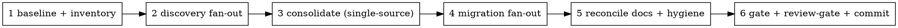

# Deep clean

## Overview

A **deliberate, periodic, whole-repo deep-clean** — the heavy counterpart to the two changed-surface skills. It runs
the full `housekeeping` checklist (gate · docs · comments · tidy · hygiene · the §6 pattern catalog) plus the
`tidy-code` reuse rules across **every** package and plugin, not just the diff.

It is an **orchestrator**: it does not restate those checklists — it **fans out** the existing rules onto slices of the
repo and reconciles the results centrally. Two things make a repo-wide pass safe instead of reckless:

- **Decompose, don't single-thread.** One context can't tidy 40+ plugins + the packages. Each unit is handled by its
  own subagent, so coverage is real and your context stays clean.
- **Apply behavior-safe, review-gate the rest.** Byte-identical tidies land automatically; anything behavior-adjacent
  (collapsing divergent sources, a casing/semantics shift) is aggregated and shown for approval before it's applied.

**Posture note:** `tidy-code` and `housekeeping` warn that repo-wide passes "create churn — use sparingly." This skill
IS that pass. Churn is expected and accepted here — the value is making it deliberate, complete, and reviewed.

## When to use

- You explicitly ask to clean / tidy / sweep / groom the **whole codebase** in one go.
- Periodically (e.g. before a milestone), to drain accrued re-rolls and doc drift repo-wide.

**When NOT to use:**

- End-of-session hygiene on what a branch changed → `housekeeping`.
- Consolidating just-written code → `tidy-code`.
- Hunting correctness bugs → `/code-review`. (This pass is hygiene; **note bugs you spot and leave them.**)

## How it runs (phases — each a todo)



1. **Baseline + inventory.** Run `pnpm fix && pnpm typecheck && pnpm test`; capture the **real** per-package counts +
   plugin count. Red gate = stop and report; don't clean on top of a broken tree. List the units (below).
2. **Discovery fan-out.** One read-only worker per unit hunts the smells and returns **findings only, no edits** — its
   `tidy-code`/`housekeeping`-§6 hits, and especially **re-roll clusters** (the same hand-rolled thing in N files) and
   **missing-helper candidates**.
3. **Consolidate (single-source FIRST).** A repo-wide reuse sweep keeps surfacing a _missing_ shared helper that many
   files re-roll (e.g. a tz-offset day converter). Promote each such helper to `@butinapp/sdk/util` **once**, centrally,
   and pick the one canonical source for every divergent-source cluster — **before** workers migrate, so they don't each
   reinvent it.
4. **Migration fan-out.** One worker per unit applies the fixes to its slice (worker contract below): behavior-safe →
   applied; behavior-adjacent → **flagged, not applied**.
5. **Reconcile docs + hygiene.** Once, centrally: `CLAUDE.md` Status counts / plugin count vs reality; website docs if
   user-facing behavior changed; fixture secret/PII + captured-data scan.
6. **Gate + review-gate + commit.** `pnpm fix && pnpm typecheck && pnpm test` green. Present the aggregated
   behavior-adjacent batch for approval; apply what's approved; re-gate. Branch off `master` if needed, stage the
   touched paths, one descriptive commit. Report real counts + bugs-left. Push/PR stays ask-first.

**Units / fan-out:** one worker per `plugins/<id>/` (its `main.ts` + `main.test.ts` + `sample.ts` are independent and
self-contained). Packages slice by subsystem (e.g. `core/src/main/<subsystem>/`, each `ui` feature dir). Cap concurrency
(see `dispatching-parallel-agents`). For the heaviest runs this is a natural `Workflow` (deterministic phased fan-out),
but parallel `Agent` dispatch is the default.

## The worker contract

Each fan-out worker gets a tight prompt: **"Apply the `tidy-code` checklist + `housekeeping` §3 comment-style rules +
§6 catalog to ONLY these files. Stay in your lane — touch nothing else."** It returns structured findings:

- **applied** — behavior-byte-identical edits it made (inlined single-use helper, reused `@butinapp/sdk/util`, dropped a
  throwaway local, fixed a history-referencing comment).
- **flagged** — behavior-adjacent edits it did **not** make (divergent-source collapse, a casing/semantics shift, a
  re-roll whose helper home doesn't exist yet) — with file:line + the proposed change.
- **bugs** — correctness issues spotted in passing, left untouched.

A worker that needs a not-yet-existing shared helper **flags** it (phase 3 creates it); it does not invent a private copy.

## Verify

The gate must be green and **test counts must not drop** (a behavior-safe pass changes no test outcome):

```bash
pnpm fix && pnpm typecheck && pnpm test
```

A flipped test means a worker changed behavior under "tidy" — revert that edit and re-classify it as flagged.

## Common mistakes

| Mistake                                                               | Fix                                                                                                                                            |
| --------------------------------------------------------------------- | ---------------------------------------------------------------------------------------------------------------------------------------------- |
| Migrating before single-sourcing the missing helper                   | Phase 3 first — promote it to `sdk/util` once, then workers reuse it.                                                                          |
| One agent tidying the whole repo                                      | Fan out per unit — single-threading guarantees partial coverage + context bloat.                                                               |
| Auto-applying a divergent-source collapse                             | Behavior-adjacent → flag and review-gate. Only byte-identical tidies auto-apply.                                                               |
| Duplicating the `tidy-code`/`housekeeping` rules into a worker prompt | Reference them by name — the rules stay single-sourced.                                                                                        |
| Forcing a helper where it reads worse                                 | A paired `slice(0,10)`/`slice(11,16)` date+time split, or a `$`-named parser used for counts, is not the helper's job — leave it and note why. |
| "Fixing" a bug found mid-pass                                         | This is hygiene. Note the bug, leave it.                                                                                                       |
